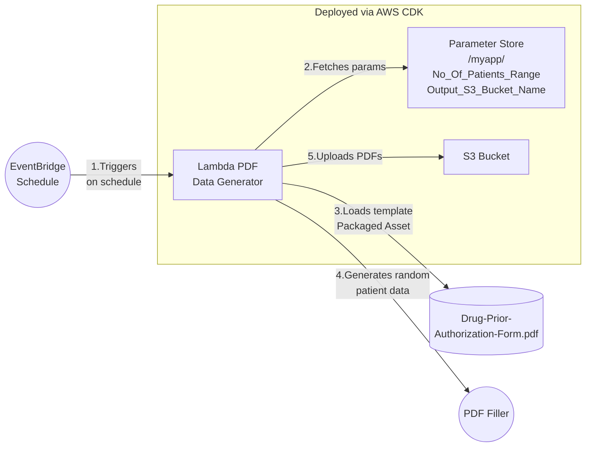
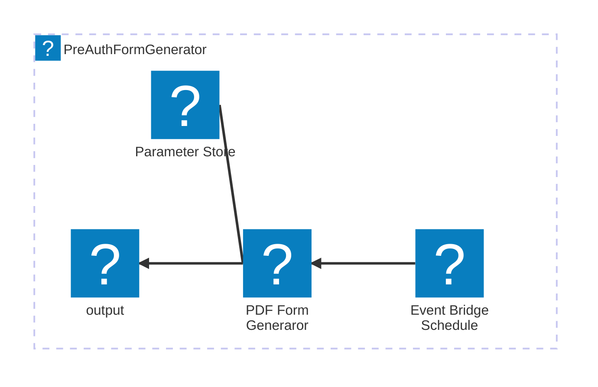

```mermaid


flowchart LR
    A((EventBridge<br>Schedule)) -->|1.Triggers<br>on schedule| B[Lambda PDF<br>Data Generator]
    B -->|2.Fetches params| C[Parameter Store<br>/myapp/<br>No_Of_Patients_Range<br>Output_S3_Bucket_Name]
    B -->|3.Loads template <br> Packaged Asset | D[(Drug-Prior-<br>Authorization-Form.pdf)]
    B -->|4.Generates random<br>patient data| E((PDF Filler))
    B -->|5.Uploads PDFs| F[S3 Bucket]
    
    subgraph Deployed via AWS CDK
      B
      C
      F
    end


```
# https://icones.js.org/collection/logos?s=aws-

``` mermaid

architecture-beta
    group PAFG(logos:aws-cloudformation)[PreAuthFormGenerator]

    service EventBridgeSchedule(logos:aws-eventbridge)[Event Bridge Schedule] in PAFG    
    service s3(logos:aws-s3)[output] in PAFG
    service lambda(logos:aws-lambda)[PDF Form Generaror] in PAFG
    service paramstore(logos:aws-systems-manager)[Parameter Store] in PAFG

    
    
    EventBridgeSchedule:L -->  R:lambda
    lambda:L -- R:paramstore
    lambda:L --> R:s3


```
